#  Krishiv Agrawal

`Software Engineer • AI Specialist • Robotics Developer`

---

### 👨‍💻 About Me

* 🎓 I am a 1st Year Computer Science student at King’s College London, passionate about AI, Robotics, Game Development, and Mathematics.
* 💼 I have experience in AI development, including a 2-month internship building a fashion chatbot using the Gemini API to analyse clothing attributes and generate model previews.
* 🚀 I’ve developed a Python game with OOP and Pygame, built a functional RC plane using Arduino and transceivers, and gained web development experience through a Kainos work placement.
* 🎯 I aim to build a career at the in AI, robotics, and immersive technology, creating intelligent and interactive systems.

### 🛠️ Tech Stack

  

### 🚀 Featured Projects

* **PanikBot:** Created an ambient AI study assistant for Discord that generates structured study guides and real-time quizzes using Gemini and a RAG pipeline.
* **Autonomous Robot Engineer:** Built an OpenCV vision pipeline combining HSV filtering and contour detection to achieve 45+ FPS real-time computer vision on a Raspberry Pi 5.
* **polluView:** Built an interactive JavaFX map renderer supporting pan, zoom, hover, and click interactions for visualising UK-wide pollution heatmaps.

### 📊 Languages

  

